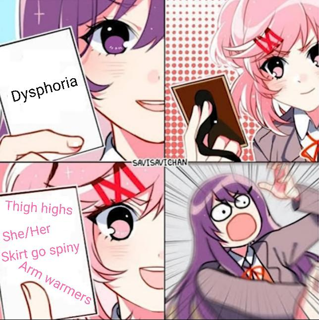
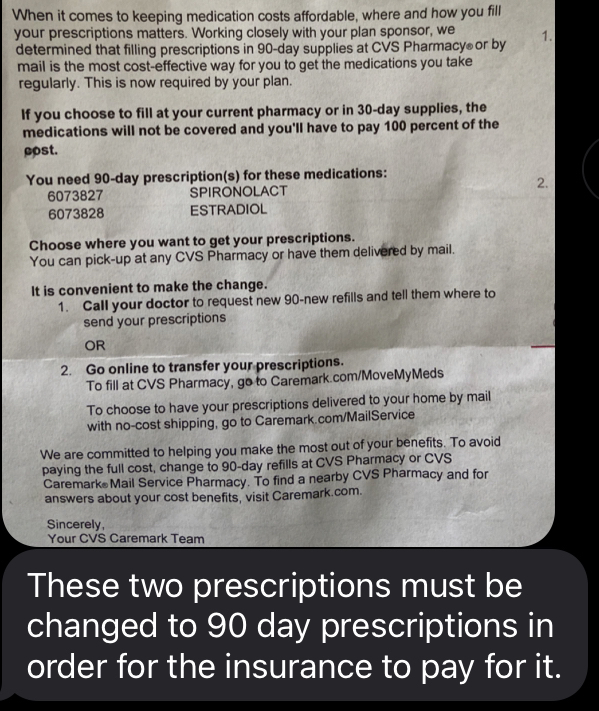

For some reason - on occasion CVS will send insurance related things (that pertain to me) to my parents,
and they open it; despite it being under my name.

## My journey in transition

So after I was diagnosed with epilepsy in 2018, I had a lot of time to think. Previously I
was an EMT working 12-14 hours on night shift 5 days a week and was a rather busy gal. 

The only reason I'd agreed to take those kinds of hours from my supervisor was so I could make the
move from non-emergent to emergent EMS. The agreement was:

- Work these hours for three months, we are low staff
- Take on-call once every two weeks
- While working night shift, station in next city as backup for EMS (they were understaffed so I was there often)

At the end of those three months, I would sign on full time for the EMS fleet. 
*So* - late August / Early September I signed my papers for EMS, got my hospital ID - and was excited to start in a few weeks!

***Unfortunately*** 
On September 16th 2018 (unfortunately, my mothers birthday) - I had a seizure right in front of her - and
was then sent to the ER. I would go on to leave EMS behind, as I would have an countless seizures over the
following year.

---

### I was given a lot of time to think
My life slowed down greatly - as all of my former University & paramedic classmates went on to graduate,
get jobs, and move on with their lives; I was left behind. I could no longer drive, and was fully dependent on others
for transportation and such, which made working hard. (Shout out to you Starbucks, and all your late nights as my dad
sat in the parking lot for an hour! [It's no wonder that everyone is trying to unionize.])

Even after returning to school, all I really did was study or play a game. The connections I made online were
the friendships I came to cherish more than any other. _(Very special shout out to my best friend Maxwell.)_

When COVID hit the US in full-force and everything shutdown and went virtual, ***I was forced into even more thought***

I had to think about:
- Who am I?
- What do I want in life?
- What really makes me ***me***?
- Am I comfortable as I am?

I ***very*** vividly remember sitting in a voice chat with three friends on Discord - just chatting. 
I came across this meme on a random meme page:

 

 

**And for some reason** - I got a weird feeling. Like butterflies,
especially regarding the idea of wearing a skirt. 
While still talking with my friends I began looking through amazon at
a few skirts, and I found one I liked. I took a screenshot of it and 
showed them asking in a joking manner, "You guys think I'd look good in this?"

> Yeah sure, go for it 

> Actually I like that other one in the recommended, but whatever makes *you happy*

I sat there *stunned*.
  I expected to be laughed at and called slurs for it - and fully expected
to crawl back into my shell. But these two just broke me out of it even further.

## I would later try to harden my shell
I was afraid of coming out. I didn't want to accept myself, and refused
to be truthful about it.
- I shaved my head
- dipped tobacco (religously)
- wore boots and big blue jeans all the time
- became obsessed with guns
- grew as big a beard as i could

and man, I became super religious. It was all a facade though.
None of it was me. It never was, and never will be.

#### Eventually I got so tired of it
I got so tired of wearing the boots, looking at the beard, shaving my head, dealing
with the tobacco, dealing with the church.

**So I got rid of it all -** I sold the guns, I grew out my hair, shaved the beard, threw out the 
tobacco, and stopped wearing the shit I hated to wear.

## What finally broke me:
My partner came out as non-binary (they/them/theirs), and their courage to do something like that
is what helped me come out in-turn.

That was over a year ago.

**Since then, I've faced various levels of transphobia**

Coming out amongst my Discord server (publicly) brought a lot of transphobia, homophobia, and 
hatred. I severed a lot of friendships and burnt many bridges.

To those I know in real life, It's been weird. I feel like I have to pick and choose who to come out to.
I'm never sure who will ostracize me, who will be apathetic, and who will be supportive.

Then there's the issues of *chasers* in my Discord, Reddit, and Twitter messages. 
I've been sent some messages that are initially innocent, and very quickly become disgusting.

**Whether any of this can actually be considered transphobia or not is besides the point:** 
It all culminates into hurting my mental health. What matters most to me right now is my partner, progressing my career,
and continuing to be myself.

## But being myself is hard when this happens.

 

 

### I received this image from my mom earlier this evening
The panic that it sent me into was insane, I've honestly never felt anything like this.
Of course - these letters are addressed to me, but my parents always open them. I'm not sure why
they don't just re-mail them, and I'm not sure why they choose to open them in the first place.

Yet they do.

The subsequent text-messages only related to insurance and medication, and me following up with the
pharmacy to make I get this resolved. It was rather benign, and she ignored the actual medications.

There was some back and forth of course, as I'd informed her that I'd been using GoodRX for my medications.

Her:
> You haven't been using the insurance to pay for your medicine?

Me:
> No, they haven't been doing 90day like i've asked the past several times

*Which was a major issue at first - however I wasn't sure how estradiol and spironolactone would
show on insurance, so I didn't want to use insurance at that
time anyway - but I guess it got me here.*

> ...some continued conversation...

Her:
> Who is your primary insurance then? Are you not on our insurance anymore?

Me:
> No I still am 
> I just am not using BC/BS for the medications because of how they keep handling the 90day
> and the overall cost is cheaper with GoodRx  
> Otherwise I think im still on it, I just haven't needed it.

Her:
> OK. As long as you're getting your prescriptions that's all that matters. But just be aware of whats going on.
> Do call them and have them change it if possible.

### And that was it.
She texted me some more regarding it an hour later and asked if I needed a full-screenshot of the
paper... but to be honest, I don't want to know what's on it.

Since then I've felt sick to my stomach, I've felt paralyzed - it's a panic attack.

I don't know if she knows what the medications are, and I don't know if she suspects something regarding them,
but she's smart; not only that - but she meticulously cared for me and my epilepsy related issues
for years before I moved out. She has an entire folder of documentation and notes, scripts, etc.

But she doesn't need all that - I'm sure she has memorized the names, and could spot something new.

**I'm afraid of the unknown and what is unsaid, just like I was in 2019/2020.** 
This scares me - because I want nothing more than to be accepted and be her daughter. I love her,
and love my family - but I can't be who they think I am. I have to be me; who I've always been.

And I'm just scared that they aren't ready to accept that.

This was a long one, but my panic attack is subsiding. I needed to get this off my chest. 
I've been so stressed lately, and this just added to it in more ways than can be imagined.