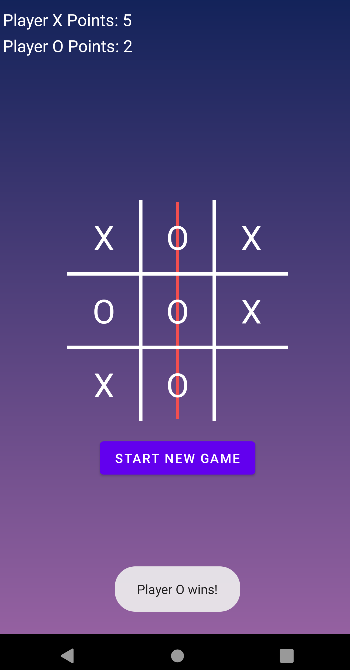

Today is the last day of my Summer semester, and as I'm finishing it out I thought I might give a few thoughts on the course, Kotlin as a language, and Android Studio as a development platform.

Additionally, I've finished my final project today - so I can talk about that a bit today.

But first, the song of the day:

<iframe style="border-radius:12px" src="https://open.spotify.com/embed/track/36LoyBmv0UAPMZDoxQxwwd?utm_source=generator" width="100%" height="80" frameBorder="0" allowfullscreen="" allow="autoplay; clipboard-write; encrypted-media; fullscreen; picture-in-picture"></iframe>

<hr>

# Android Studio
It's a great tool. It's no secret that I'm an unpaid shill for JetBrains and their various tools, but its for a reason. While their tools tend to be broken up a lot (i.e., several tools for various things: IntelliJ, Pycharm, Datagrip, CLion, etc) - and it can be a lot to process, especially if you need to switch between languages/frameworks often; I believe the **tradeoff** is that each IDE/tool does it's assigned job *very* well. 

IntelliJ seems to mirror VSCode in a lot of ways as it seems to be the <a href = "https://www.jetbrains.com/help/idea/discover-intellij-idea.html#multi-platform-IDE" >"be all tool"</a> in terms of languages, but when you get into more specific tools such as... app development (Android), or various .Net/C related programs (CLion, Rider) - JetBrains does still has you covered.

Microsoft of course has VisualStudio and VSCode. Early in my learning, I preferred VS Enterprise/Community over VSCode. I felt VSCode was very convoluted, and especially when it came to Rust and it's crates. This isn't the case with IntelliJ.

<hr>

In any case, Android studio is a fantastic tool, and the UI is something I'm pretty familiar with. 


There were times where it did get confusing, yes. But there is plenty of documentation online.

# Kotlin

I've been wanting to learn Kotlin for while, but have never quite had the chance for various reasons. I mostly got too caught up with C#, VB, or Java to spare time for it - but now that I had the chance to take a class in it - I'm pretty happy. 

App development isn't exactly my *desire* - however it does improve on my general skills, add to my portfolio, and helps make me more "well-rounded."; Ultimately I'm not too concerned, provided I find a job.

I'm honestly a big fan of the language, it felt very easy to pick up as it was so similar to the languages I've written in before. It's extremely clean and compact, and nearly entirely null safe. 

```kt
fun sayHello(maybe: String?, neverNull: Int) {
    // use of elvis operator
    val name: String = maybe ?: "stranger"
    println("Hello $name")
}
```


```kt
// returns null if...
// - foo() returns null,
// - or if foo() is non-null, but bar() returns null,
// - or if foo() and bar() are non-null, but baz() returns null.
// vice versa, return value is non-null if and only if foo(), bar() and baz() are non-null
foo()?.bar()?.baz()
```

Kotlin is pretty fun, so I hope to expand on it a little further in the future.


# Tic-Tac-Toe

Moving forward a bit - I mentioned I finished my project today. I had trouble figuring out what to do for this project, and for the longest time was working on a weather app - however <a href="https://openweathermap.org/">the weather api </a> I tend to use was giving me grief. I nixed that app after trying to use a new type of geolocation, and that failing as well. 

So - good old fashioned Tic-Tac-Toe. 



*(I also added the Player (whatever) Wins toast last minute, after having submitted it already)*
```kt
Toast.makeText(this, "Player ${gameManager.currentPlayerMark} wins!", Toast.LENGTH_LONG).show()
```

It's relatively simple, game logic wise. 
Example:

```kt
fun makeMove(position: Position): WinningLine? { // returns winning line if there is one, null otherwise
        state[position.row][position.column] = currentPlayer // set the position to the current player
        val winningLine = hasGameEnded() // check if there is a winning line

        if (winningLine == null) {
            currentPlayer = 3 - currentPlayer
        } else {
            when (currentPlayer) { // Switch to next player
                1 -> player1Points++
                2 -> player2Points++
            }
        }

        return winningLine
    }
```

```kt
private fun showWinner(winningLine: WinningLine) {
        val (winningBoxes, background) = when (winningLine) {
            // If the winning line is a horizontal line, set the background of the winning boxes to the winning color and disable the boxes
                // If the winning line is a vertical line, set the background of the winning boxes to the winning color and disable the boxes
                    // If the winning line is a diagonal line, set the background of the winning boxes to the winning color and disable the boxes
            WinningLine.ROW_0 -> Pair(listOf(one, two, three), R.drawable.horizontal_line)
            WinningLine.ROW_1 -> Pair(listOf(four, five, six), R.drawable.horizontal_line)
            WinningLine.ROW_2 -> Pair(listOf(seven, eight, nine), R.drawable.horizontal_line)
            WinningLine.COLUMN_0 -> Pair(listOf(one, four, seven), R.drawable.vertical_line)
            WinningLine.COLUMN_1 -> Pair(listOf(two, five, eight), R.drawable.vertical_line)
            WinningLine.COLUMN_2 -> Pair(listOf(three, six, nine), R.drawable.vertical_line)
            WinningLine.DIAGONAL_LEFT -> Pair(listOf(one, five, nine),
                R.drawable.left_diagonal_line
            )
            WinningLine.DIAGONAL_RIGHT -> Pair(listOf(three, five, seven),
                R.drawable.right_diagonal_line
            )
        }
```

<hr>

And of course we have to make protections for players coming to a draw:

```kt
else if(gameManager.isDraw()) { // If the game is a draw, show a message and disable the boxes
                updatePoints() // Update the points
                disableBoxes() // Disable the boxes
                startNewGameButton.visibility = View.VISIBLE // Show the start new game button
                Toast.makeText(this, "It's a draw!", Toast.LENGTH_LONG).show() // Show a message that the game is a draw
            }
```

```kt
 fun isDraw(): Boolean { // Returns true if there is a draw, false otherwise
        return state.all { row -> row.all { player -> player != 0 } } // Check if all positions are filled
    }
```

<hr>

Simply put - as two players compete get their respective letter in a row, the number will of wins will be counted; if there is a draw the game resets (apart from win count).

## My thoughts on this class 

It was a pretty decent class. It was mostly hands off, and self-paced; which I do best with. I'm mostly a self-starter / self-learner and tend to seek the information I need through various means, but that doesn't necessarily mean I'm sitting in the classroom asking questions. 

I don't particularly have a lot of negative but I will admit that I was fucked over on a surprise update that now has cost me a letter grade due to the recent test. 

Thankfully, I had a perfect score prior to that hiccup, and the issue has been fixed.

<hr>


## The Repository
if you wanna take a look at the repo, click here.

[](https://github.com/charlotte-2222/Kotlin-Tic-Tac-Toe)

The code is pretty much all there, but this is a pretty detailed explanation as well.

Thanks for reading this, if you did! ~~I'm gonna vibe before my last test of the Summer~~...
**Update now that I finished it!** It was a fairly easy test. The task was to create a simple dual-activity mortgage calculator, one activity having a fixed rate and the other with options to adjust the year / rate.

**Check it out here:**
[](https://github.com/charlotte-2222/Simple-Mortgage)

and hope I can get someone in my DM's saying:
> Yo Charlotte I have a remote software engineer job for you, pays like $65k + benefits, and you only have to appear on camera once in-a-blue moon

cause i'd sign my life way.

Sidenote:
<blockquote class="twitter-tweet" data-lang="en"><p lang="en" dir="ltr">On July 13, 2022, Earth satellites captured temperatures rising above 40 degrees Celsius (104 degrees Fahrenheit) due to extreme, record-breaking heatwaves across much of Europe, Africa, and Asia: <a href="https://t.co/tD6DmpXMyz">https://t.co/tD6DmpXMyz</a> <a href="https://t.co/cb3P1F699Y">pic.twitter.com/cb3P1F699Y</a></p>&mdash; NASA (@NASA) <a href="https://twitter.com/NASA/status/1549099315817095168?ref_src=twsrc%5Etfw">July 18, 2022</a></blockquote> <script async src="https://platform.twitter.com/widgets.js" charset="utf-8"></script> 


Waaat the fuck is this.


Alright goodnight (it's 1:24pm and I've had a beer already teehee)