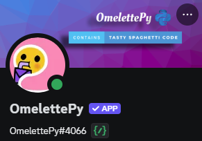

# On Pycharm, Discord, and IDEs.

*An IDE is an Integrated Development Environment, which is a software app that provides tools for programmers to write, edit, compile, debug, and test code within the single interface. Examples are:*
- Visual Studio
- Eclipse
- IntelliJ IDEA
- PyCharm

Since I began programming in early 2018 I’ve played around with various code editors/IDEs. I move from one to another as though I were a migratory bird with the inability to return to a home I’d made a season prior. Initially in my programming “career” I began with Visual Studio enterprise thanks to my schools education packages, at this time I was only working in C++ and C#. Eventually, as my degree program continued on, I found myself working in BlueJ using Java – and boy that was a nightmare. That editor easily turned me off from using Java for all eternity, it’s no secret that I prefer Kotlin over Java in every situation.

Over the years I’ve found myself working with many other IDEs such as Visual Studio code and the full suite of JetBrains tools. I’ve found that I vastly prefer JetBrains’ software over any other, by a long shot. With that said, IDE tools tend to cost money, a lot of money. While free community editions *do* exist, the tools in these editions are always lacking for my purposes; namely Database views. Most of what I do involves working with data and I prefer having a visual of the data in one tool rather than running two programs to achieve the same result. Enter JetBrains student and my tendency to circumvent rules and systems. 

With JetBrains, students are given the ability to link their *.edu* emails to their JetBrains account in order to receive JetBrains tools for free. I’ve been taking advantage of this system since 2019, but have just now run out of luck as the three college emails that I have are now deactivated *(Don’t worry, they’re actually MY emails – Yes I’ve gone to three colleges).* This is very unfortunate for me, as I’ve had to return to PyCharm community edition which lacks the vital feature easy data view. A good 90% of my programming work is done in PyCharm as I’ve been developing Discord bots for several years now and exclusively use Python and the [Discord.py](https://discordpy.readthedocs.io/en/latest/index.html) library.

Making the switch from PyCharm pro to community edition isn’t the *worst* thing, but it’s definitely not ideal as I’m now forced to use the Postgres standalone software for viewing the data in my database. Technically speaking, I have two databases - and I’m more or less fucked for the meantime when it comes the SQLite database. But this is an issue I will approach at a later date.

# Discord and Robots

Moving on from my *’woe is me’* writings regarding the lack of PyCharm Pro, I’ll now speak on the Discord bot I’ve had running for a little while now. This is my little [Ommie](https://github.com/charlotte-2222/omelettePy), a Discord utility bot. The bot is still in Semi-Development and mostly in “Beta” given that there are still several kinks that need to be addressed, specifically regarding task creation and runtime for reminders. I’m still not certain where the problem originates and I’m the only developer on this bot so there isn’t much I can do, at least quickly.

I began writing OmelettePy as a sort of spiritual successor to [Fembot](https://github.com/charlotte-2222/FembotV3), which had far less utility and was far more bogged down with useless and poorly-written “features”. However, Fembot served it’s purpose and that I envisioned four years ago. When I decided to begin coding again after a two year hiatus, I desired to write something that was somewhat more streamlined and “cleaner” than Fembot along with serving an actual purpose. Initially I thought I may start by rewriting Fembot and focus on converting the bot over to [app_commands](https://discordpy.readthedocs.io/en/latest/search.html?q=app_commands), however that represented a monumental task and would have been quite the undertaking. So, Ommie was born.

In keeping with the theme of a utility-first focus, Ommie boasts various features that allow users to keep track of various information and improve workflow, all from Discord. Could some of the features be redundant as using web services and dedicated applications may provide better options for the user? Absolutely, however these features exist to provide more options to the user. Lets run through a few of them.

### Tag Creation and Retrieval [#1](#references)

One of the primary features is the tagging systems. Imagine for a moment that you desire to save a particular piece of information, something that would come in handy for other discord users in your server – for instance, you may run a coding server and saving information that is frequently asked would be useful. Rather than typing the information again, you would simply retrieve the tag by name and the user will be given all of the information they need on a particular subject.

### Read the Fucking Manual [#2](#references)

In keeping with the theme of retrieving information on programming related subjects, say you have a user asking very basic questions – questions that are answered and explained in code documentation. Constantly explaining command syncing to users can be tiresome, especially when they clearly haven’t *read the fucking manual.* So, this feature will search by keyword and respond with the link to the associated location of the manual so the silly user in question can put in the work of reading the info before expanding on their question and issues.

### Repository Search

This feature is a little different than the others. While it is certainly true that finding repositories and searching information on GitHub is *better*, sometimes having a direct link in discord to several keyword matching repositories can be helpful – at least for quick navigation and searching. This just further aids utility focused functionality.

### Latest Commits

This command will allow the user to view the latest commit to a repository as well as view the details associated and link said commit. Additionally, features that accompany the Git commands are functions that will allow the user to create Git issues on a repo as well as view latest issues and the details therein. 

## References

Some of the features were inspired or borrowed from outside resources, I’ll list them here.
### 1.  Tagging System
The tagging system was inspired and somewhat modified from Rapptz features on his bot, [RoboDanny](https://github.com/Rapptz/RoboDanny/blob/rewrite/cogs/tags.py). I do not claim to have written this entirely on my own, I simply took inspiration and modified where needed. Initially I *had* written my own version when I was still using a SQLite3 database, however when I transferred to Postgres I decided to reference Rapptz work more closely.

### 2. RTFM
The *Read the Fucking Manual* function is directly from [RoboDanny](https://github.com/Rapptz/RoboDanny/blob/rewrite/cogs/api.py#L342) with some information omitted. I desired to use this feature and Rapptz’s code was the best use I’d found, thus all credit goes to him. 

—

In all other cases, the features are original or somewhat derivative. 

# In closing

Writing about the IDE inconveniences and a small showcase of my bot is all I truly intended for today. I have a few other things on my agenda today, I’m desperately in need of a job and would like to start looking for something – my only issue in finding one has been that I do not have the ability to drive anywhere, thus working somewhere in person is nigh-impossible. I’ve prioritized finding remote work, however that is difficult with no experience and my general lack of ability in most fields. The search has been very demoralizing. 

For now, I’m in need of a nap due to issues sleeping last night; so I think I’ll go take care of that. 

To whomever it may concern, I thank you for taking the time to read this – even if no one is reading this apart from an AI scrolling the internet for information. I’ll now leave you with some music:

<iframe style="border-radius:12px" src="https://open.spotify.com/embed/track/44Zf9Ew6cYzkuhUz3SXUPU?utm_source=generator" width="100%" height="152" frameBorder="0" allowfullscreen="" allow="autoplay; clipboard-write; encrypted-media; fullscreen; picture-in-picture" loading="lazy"></iframe>
